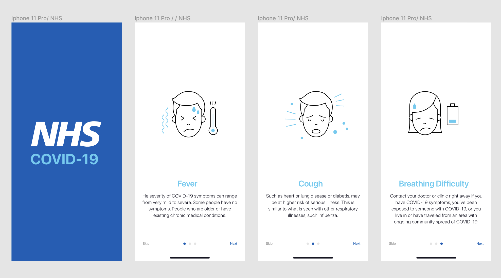
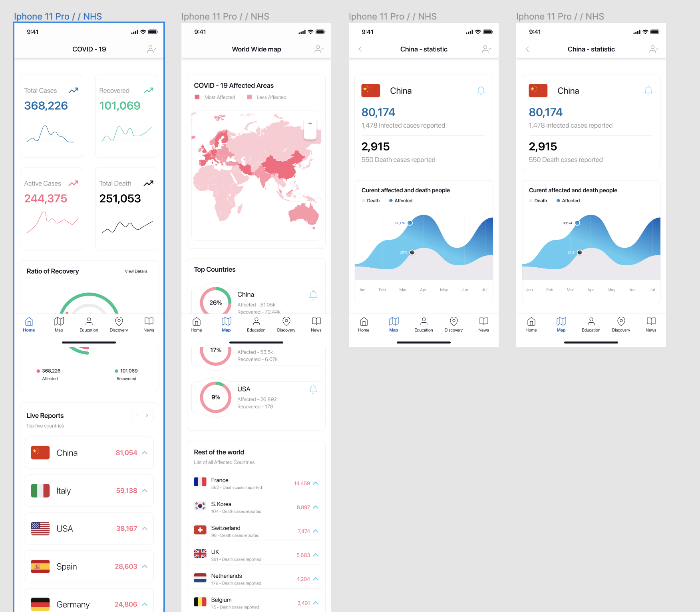
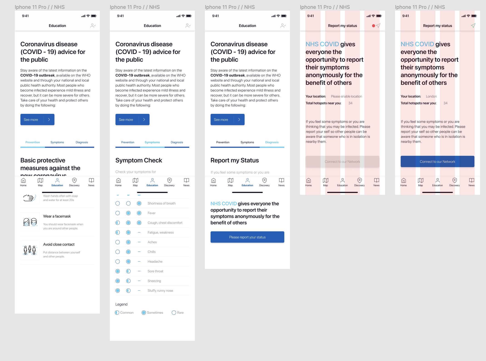
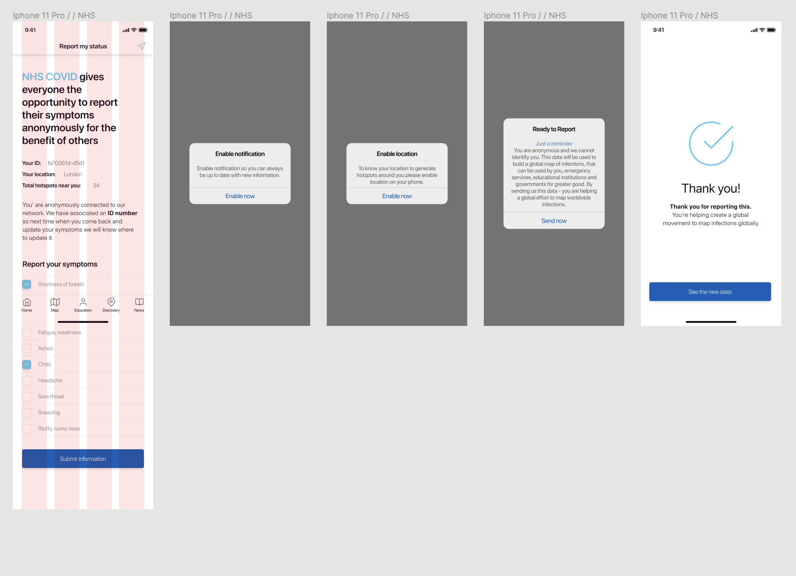
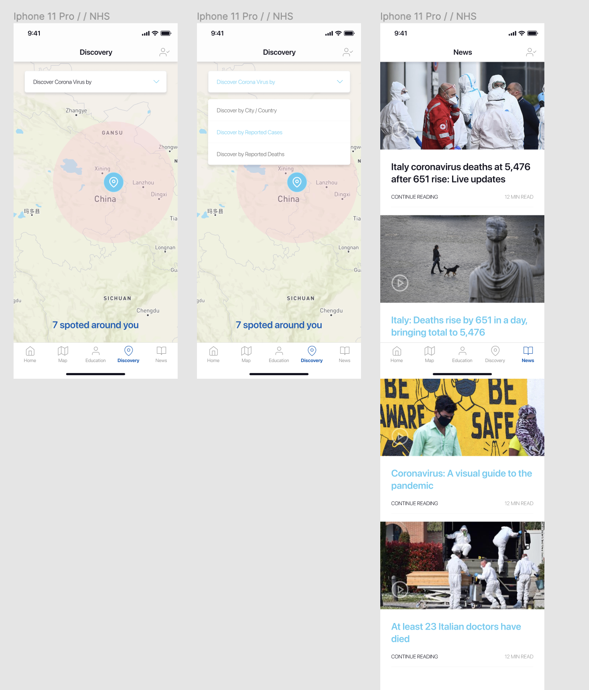

# NHS Covid App

Working on the NHS COVID App as a UX/UI designer provided a unique and profound opportunity to impact public health and safety significantly. The NHS, being a cornerstone of healthcare in the UK, is committed to leveraging technology to enhance healthcare delivery and disease management. In this venture, my contribution was centered around designing a user-friendly interface and ensuring an intuitive user experience for the app, which played a crucial role during the COVID-19 pandemic by facilitating test and trace efforts, providing health guidance, and supporting vaccination verification.

[Figma file](https://www.figma.com/file/E6Ta6ZDYXjZmFDmlF1G96H/NHS-COVID-APP?type=design&node-id=0%3A1&mode=design&t=DlofGAxYHs8Av87B-1)
[Prototype](https://www.figma.com/proto/E6Ta6ZDYXjZmFDmlF1G96H/NHS-COVID-APP?page-id=0%3A1&type=design&node-id=1-1434&viewport=-1433%2C654%2C0.5&t=OvK8Dan1t9CZi6Ht-1&scaling=scale-down&starting-point-node-id=1%3A1485&show-proto-sidebar=1&mode=design)

### My Role

As a UX/UI designer, I was tasked with the design and iterative improvement of the NHS COVID App. My responsibilities encompassed the entire design process, from initial user research and persona development to the final implementation of the interface design. The objective was to create an application that was not only functional but also accessible and engaging for the diverse UK population. Key features of the app included exposure notifications, symptom checking, booking tests, and accessing vaccination records. My role required a deep empathy for users' needs and behaviors, as well as technical proficiency in design tools and principles to ensure the app was both appealing and easy to use.

### Design Process

The development of the NHS COVID App involved a comprehensive design process:

1. **User Research and Analysis:** The first step entailed conducting thorough user research to understand the needs, behaviors, and concerns of potential app users. This included surveys, interviews, and analysis of user data to inform the design strategy.

2. **Persona Development and User Journeys:** Based on the research, I created user personas and mapped out user journeys to visualize how different users would interact with the app. This helped in identifying key functionalities and potential pain points.

3. **Wireframing and Prototyping:** I then moved on to wireframing and prototyping, using tools like Sketch and Figma to design the app's layout and test various user interactions. This stage was crucial for refining the app's structure and flow.

4. **UI Design and Branding:** With a solid wireframe in place, I focused on the UI aspects, selecting color schemes, typography, and iconography that aligned with NHS branding while ensuring high usability and accessibility standards.

5. **Usability Testing and Iteration:** The prototypes underwent rigorous usability testing with a diverse group of users. Feedback was collected and analyzed to iterate on the design, making necessary adjustments to improve user experience.

6. **Implementation and Collaboration:** Working closely with developers, I ensured the accurate implementation of the design, addressing any technical constraints while maintaining user experience quality.

7. **Monitoring and Optimization:** Post-launch, the app's performance and user feedback were continuously monitored to make further improvements. This involved analyzing user data and adapting the design to meet evolving public health guidelines and user needs.

Contributing to the NHS COVID App project was immensely fulfilling, allowing me to apply my skills in UX/UI design towards a cause with significant social impact. By focusing on creating a user-friendly and engaging interface, I aimed to encourage widespread adoption and use of the app, thereby supporting public health efforts during the COVID-19 pandemic. This project was about more than just designing an app; it was about providing a crucial tool in the fight against a global health crisis, helping to save lives and facilitate a return to normalcy.

